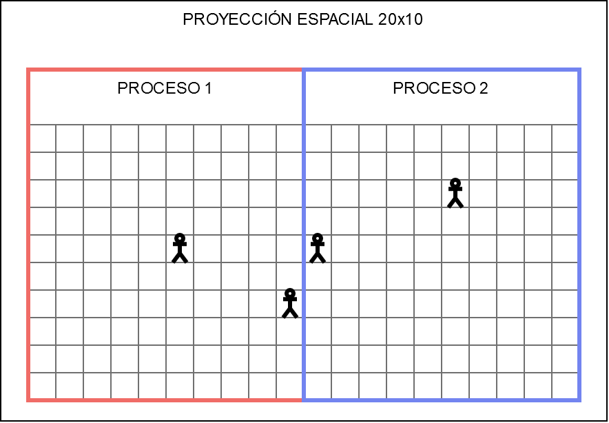
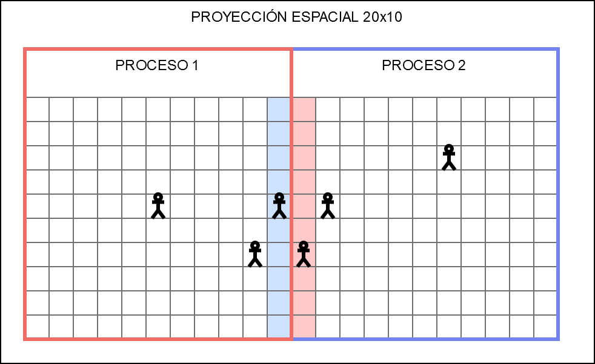

# Análisis de Repast for High Performance Computing

## Análisis General

Repast HPC es una herramienta para el desarrollo de simulaciones y modelados
basados en agentes escrito en C++. Está completamente orientado al
procesamiento paralelo, para esto se apoya en alguna implementación de MPI
("Message Passing Interface") y un wrapper provisto por la librería Boost.

Al ser un framework brinda toda la estructura para desarrollar la simulación y
el modelado. De manera resumida, posee las siguientes características:

- Jerarquía de clases que imitan los objetos de LOGO; Turtles, Patches, Links y
Observer.
- Schedulling de eventos, que permite programar eventos periódicos, y tener algo
similar al paso del tiempo.
- Contextos, lugar donde residen los agentes.
- Proyecciones espaciales y lógicas, permiten establecer relaciones entre agentes.
- Comunicación entre procesos, dado las características paralelas del framework.

Puede utilizarse en cualquier sistema *nix, incluyendo MacOS, Linux y FreeBSD.

## Compilación

Al estar desarrollado en C++, que carece de un gestor de paquetes como otros
lenguajes, las dependencias se tornan problemáticas. Debido a esto, Repast
provee un archivo con las librerías y versiones apropiadas:

[https://github.com/Repast/repast.hpc/releases/tag/v2.3.0](https://github.com/Repast/repast.hpc/releases/tag/v2.3.0)

Las librerías de las que depende Repast son:

- Herramientas de compilación (g++, make, diff).
- MPI
- NetCDF
- CURL
- Boost: serialization, system, filesystem y mpi.

### Instalación de Dependencias

La manera más efectiva de instalar todas las dependencias es utilizar el archivo
mencionado anteriormente, siguiendo las instrucciones para la instalación
manual, para el caso de un Linux basado en Debian, los comandos a ejecutar son
los siguientes:

```sh
cd MANUAL_INSTALL

apt-get update && apt-get install build-essential

./install.sh curl
./install.sh mpich 
export PATH=$HOME/sfw/MPICH/bin/:$PATH
./install.sh netcdf
./install.sh boost
./install.sh rhpc
```

Todas las librerías y headers son instalados en la carpeta `~/sfw/`. En la
línea 7 se agrega la carpeta de MPICH a la variable PATH para que Boost y la
terminal puedan encontrar el binario de MPI.

Para ver ejemplos de compilación, puede usarse como guía los ejemplos que se
encuentran en: [https://repast.github.io/hpc_tutorial/TOC.html](https://repast.github.io/hpc_tutorial/TOC.html).

## Ejecución

El binario generado debe ejecutarse a través de MPICH (u otra implementación de
MPI), para que se genere el entorno adecuado, especificando la cantidad de
procesos:

```
mpirun -n P repast.exe
```

Siendo P la cantidad de procesos, también puede enviarse parámetros en caso de
que el programa lo requiera.

## Estructura de un programa de Repast HPC

Dada la complejidad y el alcance del framework, Repast HPC requiere que se
definan un conjunto de clases para establecer un entorno donde ejecutar la
simulación. Este se compone de la siguiente manera:

- Agentes
- Programa (*schedule*)
- Contexto
- Proyección
  
### Agentes

Implementados como clases de C++, cuyo estado es representado con
variables internas. Y su comportamiento se establece a través de métodos. Cada
agente dispone de un ID único para poder identificarse dentro de la simulación.

### Programa (*schedule*)

Como se mencionó, Repast provee un mecanismo para generar eventos periódicos,
basado en *ticks*. Pueden definirse el instante en el cuál se genera el evento,
y su periodicidad.

### Contexto

Se comporta como un contenedor de toda la población de agentes. Repast se
asegura que no haya dos agentes iguales (mismo ID) en el contexto.

### Proyección

No es estrictamente necesaria, pero resulta indispensable ya que permite
establecer relaciones entre los agentes. RHPC provee dos tipos de proyecciones:
espaciales y lógicas, la primera se utiliza para modelar mundos bidimensionales,
estableciendo una matriz donde se encuentran dispuestos los agentes; la segunda
permite modelar relaciones genéricas, a través de grafos, para generar
interacción entre agentes.

## Configuración y Ejecución de la Simulación

Una simulación de Repast HPC se compone, por lo tanto, de un conjunto de agentes
dentro de un contexto, los cuales poseen un comportamiento definido a través de
métodos. Para realizar estos comportamientos de manera periódica, se registran
en un Scheduler que se encargará de incremetar los ticks y llamar a los métodos
que se hayan específicado para ese instante de la simulación.

## Paralelismo

Repast for High Performance Computing es un framework, como mencionamos,
orientado completamente al cómputo en paralelo. Para esto se apoya en el
protocolo MPI, por lo que se trata de memoria distribuida. Esto afecta
directamente al modelado del problema, ya que cada proceso ejecutando la
simulación posee un conjunto de agentes de los cuales tiene control total,
llamados agentes locales. 
Para poder relacionarse con el resto de los agentes de la simulación, que
residen en otros procesos, debe solicitar una copia de los mismos, los cuales
pasan a ser denominados agentes no-locales. Esta comunicación es unidireccional,
es decir, los cambios de estado realizados sobre agentes no-locales no se
propagan al proceso donde se encuentran originalmente. Por este motivo se debe
asegurar que las copias de los  agentes en cada proceso estén sincronizadas con
los agentes reales. 

De todas formas, es posible mover agentes de un proceso a otro, de manera de
cambiar el proceso que tienen a cargo. Esto resulta útil para balancear carga y,
como analizaremos a continuación, para proyecciones espaciales.

Por ejemplo, se quiere modelar un juego de tiro al blanco, donde hay dos
agentes, un arquero y un blanco, y donde cada agente se encuentra en procesos
diferentes, A y B. Cuando el arquero dispare una flecha y acierte en el
blanco, el proceso A no puede realizar cambios en el blanco para reflejar el
acierto, ya que este se encuentra en el proceso B.

### Proyecciones Espaciales

Para facilitar el paralelismo, Repast HPC provee, para proyecciones espaciales, una
manera de particionar el plano físico. Asignando cada partición del plano a un
proceso diferente, permitiendo dividir la grilla en M x N procesos.

Ahora los agentes se encuentran distribuidos en diversos procesos, de acuerdo a
su ubicación en el mapa:



Dado que la principal aplicación de una proyección espacial es obtener otros
agentes que se encuentren en la proximidad, surge un problema: cuando un agente
en el *borde* del proceso solicita los agentes que lo rodean, recibe solo
aquellos que se encuentren en el mismo proceso.

Para solucionar esto, Repast agrega una *zona de amortiguamiento* como
seguridad: cuando un agente se acerca al borde es copiado al proceso adyacente
(como un agente no-local, por lo cual no puede modificarse, pero permite saber
de su existencia). De esta manera, cuando un agente cercano al borde solicite
los agentes que lo rodean, recibirá correctamente los agentes.



En color puede verse toda la información que fue copiada desde el otro proceso.

El tamaño de la zona de amortiguamiento es definido por el usuario, una
amortiguación chica reduce la comunicación entre procesos pero reduce la
distancia a la cual ven los agentes en otros procesos. Por lo tanto se debe
establecer el mínimo tamaño posible. 
